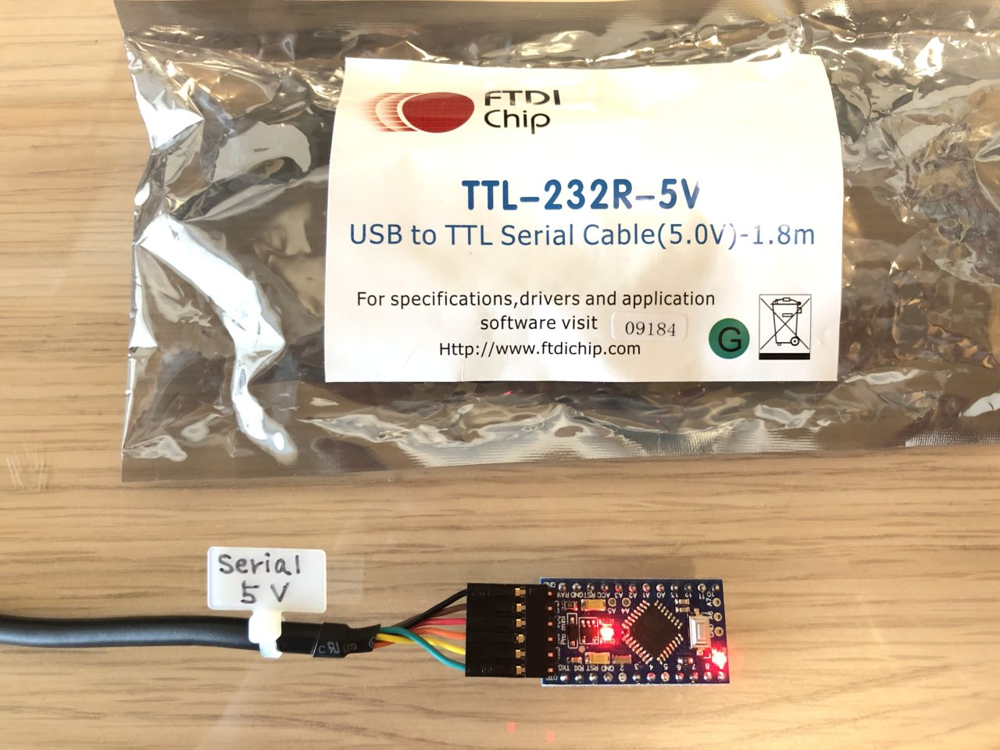
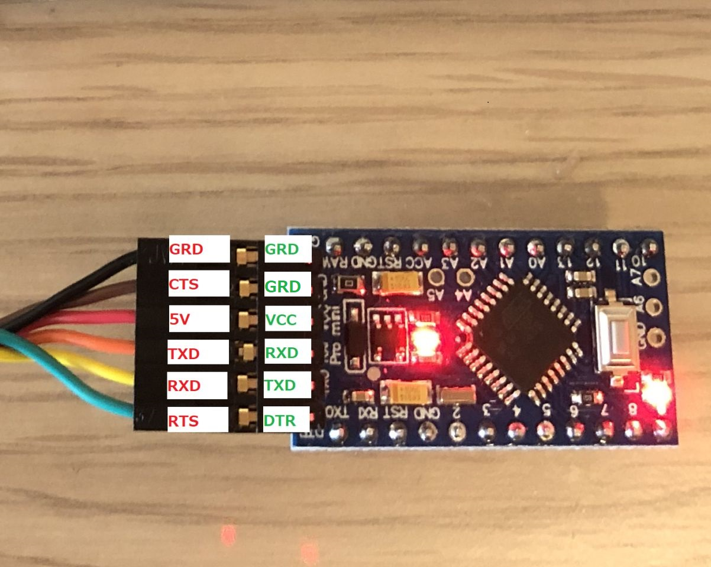
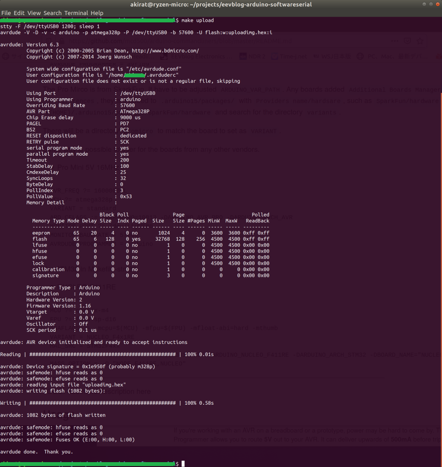

# Arduino Makefiles for commandliners

Makefiles which are small as possible for using Arduino libraries.

The regular procedure to adopt custom designed development boards to Arduino require revising boards.txt to match the new dev boards. In this project it is aiming to be able to adopt your own new board by changing few lines in Makefile. It is convenient for engineers who are not using only off-the-shelf boards.

It is also beneficial who are constrained (or like) to use only an editor for developments or would like to understand how to build Arduino libraries with Makefiles.

Currently supporting AVR and STM32 only. I have no intention to make this project to replace arduino-mk.

## Index

 - [Prerequisites](#Prerequisites)
 - [Basic flow](#Basic-flow)
 - [Makefils for AVR and STM32](#Makefile-which)
 - [Configuring Makefiles to point installed Arduino](#Makefile-arduino)
 - [Configuring Makefiles for dev boards](#Makefile-dev-baords)
 - [Usage](#Usage)
 - [Appendix](#Appendix)
 - [Credits](#credits)
 - [TODO](#TODO)

## Prerequisites <a id="Prerequisites"></a>

*  Arduino IDE which comes with Arduino IDE for programming AVR
*  SparkFun Arduino Boards Addon Files
*  Arduino_Core_STM32 for programming STM32
*  Devlopment tools, gcc and etc for the cpu

The latest Arduino IDE must be installed on development machine. (tested on 1.8.13)
Only supports Linux for the host development PC.
I only have tested on Ubuntu 18.04 at the moment.

Arduino Pro Micro requires addon files from SparkFun.

The Arduino_Core_STM32 must be installed who programs STM32 as well.

I do not have a plan supporting Windows at the moment for keeping the Makefile simple which is the main objective of this project.

Link to how to install Arduino IDE:  
([https://ubuntu.com/tutorials/install-the-arduino-ide#2-installing-via-a-tarball](https://ubuntu.com/tutorials/install-the-arduino-ide#2-installing-via-a-tarball))  
 (I had to replace `./install.sh` to `sudo ./install.sh` in the instruction in my case.)

Link to how to install SparkFun Arduino Boards Addon Files:  
([https://github.com/sparkfun/Arduino_Boards](https://github.com/sparkfun/Arduino_Boards))

Link to how to install Arduino_Core_STM32:  
([https://github.com/stm32duino/Arduino_Core_STM32](https://github.com/stm32duino/Arduino_Core_STM32))

These are the minimum packages required to build. (Only tested on Ubuntu at the moment)
```sh
$ sudo apt-get -y update
$ sudo apt-get -y install apt-utils apt xz-utils wget git
```

For AVR:
```sh
$ sudo apt-get -y install binutils-avr gcc-avr avr-libc avrdude
```

For STM32:
```sh
$ sudo apt-get -y install gcc-arm-none-eabi binutils-arm-none-eabi
$ sudo dpkg --add-architecture i386 && sudo apt-get update
$ sudo apt install libusb-1.0.0:i386
```

## Basic flow of using Makefiles for Arduino libraries without using GUI  <a id="Basic-flow"></a>

  1. Download Makefile for your project
  1. Customize the path where Arduino libraries are installed
  1. Customize variables in Makefile for your dev boards
  1. Build and upload

## Makefils for AVR and STM32 <a id="Makefile-which"></a>

First download Makefiles as bellow at the location where the main sources for your developments.

For AVR:
```sh
$ wget https://raw.githubusercontent.com/mcd500/arduino-commandliners/master/Makefile
```

For STM32:
```sh
$ wget https://raw.githubusercontent.com/mcd500/arduino-commandliners/master/Makefile-stm32
```

The `Makefile` is for AVR only. The `Makefile-stm32` is for STM32 only.

For STM32, copying `Makefile-stm32` to `Makefile`:
```sh
$ cp Makefile-stm32 Makefile
```
should be fine for most of the time, since building binaries for both AVR and STM32 is rare.

If your project require to co-exist both, then:
```sh
$ make -f Makefile-stm32
```
every time will do with having two different Makefiles.

The one of the source files must be `main.cpp` since Arduino libraries expect to be called from c++.

I have prepared `main.cpp` for testing customized Makefiles in later procedures. It is just an example of blinking led from Arduino porject.
```sh
$ wget https://raw.githubusercontent.com/mcd500/arduino-commandliners/master/main.cpp
```

## Configuring Makefile where the arduino is installed <a id="Makefile-arduino"></a>

Some lines in Makefile must match where the arduino is installed in host machine. This is my example.

```
ARDUINO_DIR = $(HOME)/projects/arduino-1.8.13-linux64/arduino-1.8.13
```

Change the portion of `1.8.13` with the Arduino version installed.

The `ARDUINO_DIR` have to be pointing the directory where following files after untar the arduino-1.8.13-linux64.tar.xz.
```sh
$ ls
arduino                 examples    java       reference      tools-builder
arduino-builder         hardware    lib        revisions.txt  uninstall.sh
arduino-linux-setup.sh  install.sh  libraries  tools
```

Some more lines to modify for STM32 in Makefile-stm32.

```
ARM_GCC_PATH := $(HOME)/.arduino15/packages/STM32/tools/xpack-arm-none-eabi-gcc/9.2.1-1.1/bin/
TOOLS_DIR = $(HOME)/.arduino15/packages/STM32/tools
CMSIS_DIR = $(TOOLS_DIR)/CMSIS/5.5.1
```

The `9.2.1-1.1` and `5.5.1` differs depending on the Arduino version.

Typically additional packages of `STM32` and  `CMSIS` are in locations bellow after following install procedure of Arduino_Core_STM32.

```
TOOLS_DIR = $(HOME)/.arduino15/packages/STM32/tools
CMSIS_DIR = $(HOME)/.arduino15/packages/STM32/tools/CMSIS/5.5.1
```

## Configuring Makefile for target development board  <a id="Makefile-dev-baords"></a>

These are the lines to match the dev boards, which I have tested on AVR. For 3.3V 8MHz models, change the `AVR_FREQ ?= 16000000L` to `8000000L`.

* Uno 5V 16MHz
```
AVR_FREQ ?= 16000000L
MCU ?= atmega328p
VARIANT = standard
ARD_CFLAGS := -DARDUINO=10813 -DARDUINO_AVR_UNO -DARDUINO_ARCH_AVR
MONITOR_PORT ?= /dev/ttyACM0
MONITOR_BAUDRATE = 115200
AVRDUDE_PROGRAMMER = arduino # choose it from upload.protocol in boards.txt
```

The MCU could be chosen from `atmega32u4 atmega328p atmega168 atmega2560 atmega1280 atmegang atmega8 attiny85`.

The values to select the `VARIANT` are directory name under `${ARDUINO_DIR}/hardware/arduino/avr/variants`.

It must to have Arduino version similar to `-DARDUINO=10813` in `ARD_CFLAGS` to build libraries successfully. The version `1.8.13` will be `10813`, 1.5.0 will be `10500`.

The `-DARDUINO_ARCH_AVR` is also required for AVR.

The `-DARDUINO_AVR_UNO` is not mandatory, I include it there just because genuine Arduino IDE adds it.

The `MONITOR_BAUDRATE` and `AVRDUDE_PROGRAMMER` must have the exact value on each board for `avrdude` to upload the binary correctly.
The available values could be found from the upload.protocol in `boards.txt`. The `boards.txt` could be found at `${ARDUINO_DIR}/hardware/arduino/avr/boards.txt`.

The `MONITOR_PORT` may vary depend on the USB chip on the dev boards. The easiest way to find the value is to watch which appears when connecting the board under `/dev/` on your host machine. Most of the time the AVR Arduino boards are `/dev/ttyACM0` and `/dev/ttyUSB0` from other vendors.

* Pro Micro 5V 16MHz from SparkFun
```
AVR_FREQ ?= 16000000L
MCU ?= atmega32u4
ARDUINO_VAR_PATH := $(HOME)/.arduino15/packages/SparkFun/hardware/avr/1.1.13/variants
VARIANT = promicro
ARD_CFLAGS := -DARDUINO=10813 -DARDUINO_AVR_MICRO -DARDUINO_ARCH_AVR -DUSB_VID=0x1b4f -DUSB_PID=0x9206
MONITOR_PORT ?= /dev/ttyUSB0
MONITOR_BAUDRATE = 57600
AVRDUDE_PROGRAMMER = avr109
```

The Pro Mirco is from SkarkFun. It have to be adjusted `ARDUINO_VAR_PATH`. Any boards added `Additional Boards Manager URLs` at `File -> Preferences`, they are added to `.arduino15/packages/` with `Providers name/hardsare`, such as `SparkFun/hardware`.
Look inside the `${HOME}/.arduino15/packages/SparkFun/hardware` and search for the directory `variants`.

There will be a directory `promicro` to match the board to set as `VARIANT`. Same way to fine `ARDUINO_VAR_PATH` and `VARIANT` is possible for the boards from any other vendors.

* Pro Mini 5V 16MHz
```
AVR_FREQ ?= 16000000L
MCU ?= atmega328p
VARIANT = standard
ARD_CFLAGS := -DARDUINO=10813 -DARDUINO_AVR_PRO -DARDUINO_ARCH_AVR
MONITOR_PORT ?= /dev/ttyUSB0
MONITOR_BAUDRATE = 57600
AVRDUDE_PROGRAMMER = arduino
```

See [how to connect UART to PC](#promicro-usb-serial).
Most of the boards works with `MONITOR_BAUDRATE = 57600`.

For STM32 in Makefile-stm32.

* NUCLEO-F411RE
```
MCU ?= cortex-m4
FPU ?= fpv4-sp-d16
ISAFLAGS  = -mcpu=$(MCU) -mfpu=$(FPU) -mfloat-abi=hard -mthumb
VARIANT = NUCLEO_F4x1RE
HAL_SRC = STM32F4xx
ARD_CFLAGS := -DSTM32F4xx -DARDUINO=10813 -DARDUINO_NUCLEO_F411RE -DARDUINO_ARCH_STM32 -DBOARD_NAME="NUCLEO_F411RE" -DSTM32F411xE -DHAL_UART_MODULE_ENABLED
MASS_OPTION = -O "NODE_F411RE,NUCLEO"
```

TODO: add more description here

## Usage <a id="Usage"></a>


After changing your sources, then typing from command line:
```sh
$ make
```
will build binaries.

If you would like to write the image to the dev board every time after updating sources:
```sh
$ make upload
```
will build the sources and write it to dev board consequently.

Use bellow for mass storage method of writing binary to STM32:
```sh
$ make -f Makefile-stm32 upload-mass
```

## Appendix <a id="Appendix"></a>

### How to connect Arduino Pro Mini with use-serial for uploading image <a id="promicro-usb-serial"></a>

I used a ftdi usb serial/UART converter cable. Any usb serial boards are fine connecting wires as described in the pictures:  

| USB-UART | Target board |
|----------|----------|
| GRD | GRD |
| 5V or 3.3V | VCC, mine is 5V 16MHz board |
| TXD | RXD |
| RXD | TXD |
| RTS | DTR |

The CTS from usb-serial is not used.

Use 3.3V usb-serial boards instead of 5V when the target boards is for 3.3V.

  

## Credits <a id="Credits"></a>

The first initial Makefile was developed for the question at eevblog forum by @ksoviero.
https://www.eevblog.com/forum/programming/i-dont-understand-libraries-in-c/
After my post at the forum, I spent about three days in my spare time and it became to this porject. Thanks!

The Makefile is derived from arduino-mk project. This is main reason for selecting GPL for this project.

## TODO <a id="TODO"></a>

Support more STM32 boards.  
Support serial mode writing for STM32.  
Would like to support RISC-V in the future.  
